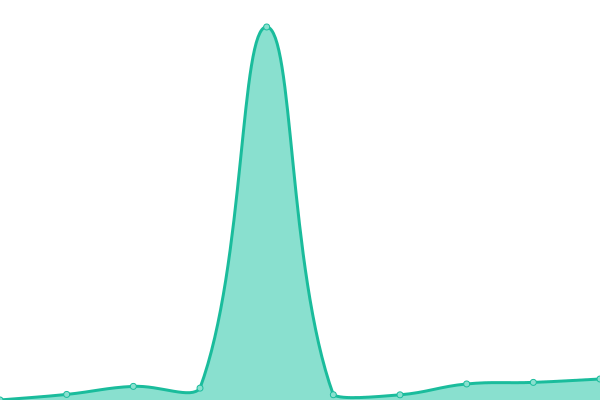
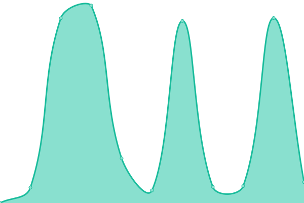
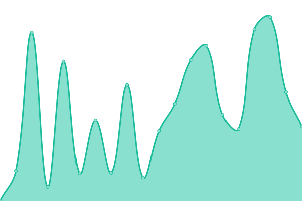
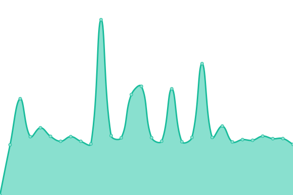
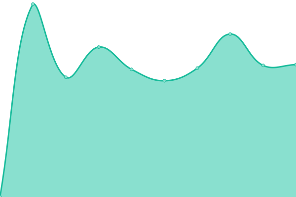

# [📈 Live Status](https://octubre-softlab.github.io/upptime): <!--live status--> **🟩 All systems operational**

This repository contains the open-source uptime monitor and status page for [octubre-softlab](https://octubre-softlab.github.io/upptime), powered by [Upptime](https://github.com/upptime/upptime).

With [Upptime](https://upptime.js.org), you can get your own unlimited and free uptime monitor and status page, powered entirely by a GitHub repository. We use [Issues](https://github.com/octubre-softlab/upptime/issues) as incident reports, [Actions](https://github.com/octubre-softlab/upptime/actions) as uptime monitors, and [Pages](https://octubre-softlab.github.io/upptime) for the status page.

<!--start: status pages-->
<!-- This summary is generated by Upptime (https://github.com/upptime/upptime) -->
<!-- Do not edit this manually, your changes will be overwritten -->
<!-- prettier-ignore -->
| URL | Status | History | Response Time | Uptime |
| --- | ------ | ------- | ------------- | ------ |
|  [Ahora+ (rrhh.octubre.org.ar)](https://rrhh.octubre.org.ar/api/health) | 🟩 Up | [ahora-rrhh-octubre-org-ar.yml](https://github.com/octubre-softlab/octubre-upptime/commits/HEAD/history/ahora-rrhh-octubre-org-ar.yml) | 

 403ms
     
 | 

<a href="https://octubre-softlab.github.io/octubre-upptime/history/ahora-rrhh-octubre-org-ar">100.00%</a>
    

|  [Ahora+ Test](https://testrrhh.octubre.org.ar/api/health) | 🟩 Up | [ahora-test.yml](https://github.com/octubre-softlab/octubre-upptime/commits/HEAD/history/ahora-test.yml) | 

 643ms
     
 | 

<a href="https://octubre-softlab.github.io/octubre-upptime/history/ahora-test">100.00%</a>
    

|  [Arrabaleros (arrabal.sportivobarracas.com.ar)](http://arrabal.sportivobarracas.com.ar/api/health) | 🟩 Up | [arrabaleros-arrabal-sportivobarracas-com-ar.yml](https://github.com/octubre-softlab/octubre-upptime/commits/HEAD/history/arrabaleros-arrabal-sportivobarracas-com-ar.yml) | 

 2889ms
     
 | 

<a href="https://octubre-softlab.github.io/octubre-upptime/history/arrabaleros-arrabal-sportivobarracas-com-ar">100.00%</a>
    

|  [CAD (cad.fateryh.org.ar)](https://cad.fateryh.org.ar/api/health) | 🟩 Up | [cad-cad-fateryh-org-ar.yml](https://github.com/octubre-softlab/octubre-upptime/commits/HEAD/history/cad-cad-fateryh-org-ar.yml) | 

 884ms
     
 | 

<a href="https://octubre-softlab.github.io/octubre-upptime/history/cad-cad-fateryh-org-ar">100.00%</a>
    

|  [Fateryh (octubre.fateryh.org.ar)](https://octubre.fateryh.org.ar/api/health) | 🟩 Up | [fateryh-octubre-fateryh-org-ar.yml](https://github.com/octubre-softlab/octubre-upptime/commits/HEAD/history/fateryh-octubre-fateryh-org-ar.yml) | 

 809ms
     
 | 

<a href="https://octubre-softlab.github.io/octubre-upptime/history/fateryh-octubre-fateryh-org-ar">100.00%</a>
    

|  [GUAU (guau.umet.edu.ar)](https://guau.umet.edu.ar/api/health) | 🟩 Up | [guau-guau-umet-edu-ar.yml](https://github.com/octubre-softlab/octubre-upptime/commits/HEAD/history/guau-guau-umet-edu-ar.yml) | 

 923ms
     
 | 

<a href="https://octubre-softlab.github.io/octubre-upptime/history/guau-guau-umet-edu-ar">100.00%</a>
    

|  [Helios (helios.osperyh.org.ar)](https://helios.osperyh.org.ar/health) | 🟩 Up | [helios-helios-osperyh-org-ar.yml](https://github.com/octubre-softlab/octubre-upptime/commits/HEAD/history/helios-helios-osperyh-org-ar.yml) | 

 713ms
     
 | 

<a href="https://octubre-softlab.github.io/octubre-upptime/history/helios-helios-osperyh-org-ar">83.56%</a>
    

|  [ISSA App (app.edificarseguros.com.ar)](https://app.edificarseguros.com.ar/api/health) | 🟩 Up | [issa-app-app-edificarseguros-com-ar.yml](https://github.com/octubre-softlab/octubre-upptime/commits/HEAD/history/issa-app-app-edificarseguros-com-ar.yml) | 

 750ms
     
 | 

<a href="https://octubre-softlab.github.io/octubre-upptime/history/issa-app-app-edificarseguros-com-ar">100.00%</a>
    

|  [ISSA (issa.edificarseguros.com.ar)](https://issa.edificarseguros.com.ar/api/health) | 🟩 Up | [issa-issa-edificarseguros-com-ar.yml](https://github.com/octubre-softlab/octubre-upptime/commits/HEAD/history/issa-issa-edificarseguros-com-ar.yml) | 

 862ms
     
 | 

<a href="https://octubre-softlab.github.io/octubre-upptime/history/issa-issa-edificarseguros-com-ar">100.00%</a>
    

|  [Mepadip (octubre.mepadip.com.ar)](https://octubre.mepadip.com.ar/api/health) | 🟩 Up | [mepadip-octubre-mepadip-com-ar.yml](https://github.com/octubre-softlab/octubre-upptime/commits/HEAD/history/mepadip-octubre-mepadip-com-ar.yml) | 

 910ms
     
 | 

<a href="https://octubre-softlab.github.io/octubre-upptime/history/mepadip-octubre-mepadip-com-ar">100.00%</a>
    

|  [Mi Obra App (miobra.osperyh.org.ar)](https://miobra.osperyh.org.ar/api/health) | 🟩 Up | [mi-obra-app-miobra-osperyh-org-ar.yml](https://github.com/octubre-softlab/octubre-upptime/commits/HEAD/history/mi-obra-app-miobra-osperyh-org-ar.yml) | 

 1097ms
     
 | 

<a href="https://octubre-softlab.github.io/octubre-upptime/history/mi-obra-app-miobra-osperyh-org-ar">100.00%</a>
    

|  [Mi Web App (miweb.umet.edu.ar)](https://miweb.umet.edu.ar/api/health) | 🟩 Up | [mi-web-app-miweb-umet-edu-ar.yml](https://github.com/octubre-softlab/octubre-upptime/commits/HEAD/history/mi-web-app-miweb-umet-edu-ar.yml) | 

 899ms
     
 | 

<a href="https://octubre-softlab.github.io/octubre-upptime/history/mi-web-app-miweb-umet-edu-ar">100.00%</a>
    

|  [OctubreOSPERYH (octubre.osperyh.org.ar)](https://octubre.osperyh.org.ar/api/health) | 🟩 Up | [octubre-osperyh-octubre-osperyh-org-ar.yml](https://github.com/octubre-softlab/octubre-upptime/commits/HEAD/history/octubre-osperyh-octubre-osperyh-org-ar.yml) | 

 906ms
     
 | 

<a href="https://octubre-softlab.github.io/octubre-upptime/history/octubre-osperyh-octubre-osperyh-org-ar">100.00%</a>
    

|  [OSRA App (app.osperyhra.org.ar)](https://app.osperyhra.org.ar/api/health) | 🟩 Up | [osra-app-app-osperyhra-org-ar.yml](https://github.com/octubre-softlab/octubre-upptime/commits/HEAD/history/osra-app-app-osperyhra-org-ar.yml) | 

 743ms
     
 | 

<a href="https://octubre-softlab.github.io/octubre-upptime/history/osra-app-app-osperyhra-org-ar">100.00%</a>
    

|  [OSRA (octubre.osperyhra.org.ar)](https://octubre.osperyhra.org.ar/api/health) | 🟩 Up | [osra-octubre-osperyhra-org-ar.yml](https://github.com/octubre-softlab/octubre-upptime/commits/HEAD/history/osra-octubre-osperyhra-org-ar.yml) | 

 866ms
     
 | 

<a href="https://octubre-softlab.github.io/octubre-upptime/history/osra-octubre-osperyhra-org-ar">100.00%</a>
    

|  [SERACARH (intranet.seracarh.org.ar)](http://intranet.seracarh.org.ar/api/health) | 🟩 Up | [seracarh-intranet-seracarh-org-ar.yml](https://github.com/octubre-softlab/octubre-upptime/commits/HEAD/history/seracarh-intranet-seracarh-org-ar.yml) | 

 527ms
     
 | 

<a href="https://octubre-softlab.github.io/octubre-upptime/history/seracarh-intranet-seracarh-org-ar">100.00%</a>
    

|  [SIGA (siga.octubre.org.ar)](https://siga.octubre.org.ar/api/health) | 🟩 Up | [siga-siga-octubre-org-ar.yml](https://github.com/octubre-softlab/octubre-upptime/commits/HEAD/history/siga-siga-octubre-org-ar.yml) | 

 1960ms
     
 | 

<a href="https://octubre-softlab.github.io/octubre-upptime/history/siga-siga-octubre-org-ar">100.00%</a>
    

|  [Union (union.umet.edu.ar)](http://union.umet.edu.ar/) | 🟩 Up | [union-union-umet-edu-ar.yml](https://github.com/octubre-softlab/octubre-upptime/commits/HEAD/history/union-union-umet-edu-ar.yml) | 

 521ms
     
 | 

<a href="https://octubre-softlab.github.io/octubre-upptime/history/union-union-umet-edu-ar">100.00%</a>
    

<!--end: status pages-->

[**Visit our status website →**](https://octubre-softlab.github.io/upptime)

## 📄 License

- Powered by: [Upptime](https://github.com/upptime/upptime)
- Code: [MIT](./LICENSE) © [octubre-softlab](https://octubre-softlab.github.io/upptime)
- Data in the `./history` directory: [Open Database License](https://opendatacommons.org/licenses/odbl/1-0/)
