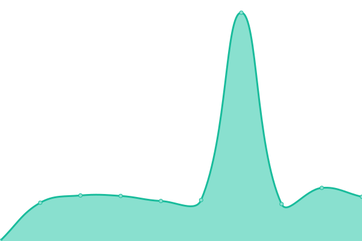

# [📈 Estado en vivo](https://status.octubre.org.ar): <!--live status--> **🟧 Partial outage**

This repository contains the open-source uptime monitor and status page for [Octubre Departamento Sistemas](https://status.octubre.org.ar), powered by [Upptime](https://github.com/upptime/upptime).

With [Upptime](https://upptime.js.org), you can get your own unlimited and free uptime monitor and status page, powered entirely by a GitHub repository. We use [Issues](https://github.com/octubre-softlab/octubre-upptime/issues) as incident reports, [Actions](https://github.com/octubre-softlab/octubre-upptime/actions) as uptime monitors, and [Pages](https://status.octubre.org.ar) for the status page.

## [📈 Live Status](https://demo.upptime.js.org): <!--live status--> **🟧 Partial outage**

<!--start: status pages-->
<!-- This summary is generated by Upptime (https://github.com/upptime/upptime) -->
<!-- Do not edit this manually, your changes will be overwritten -->
<!-- prettier-ignore -->
| URL | Status | History | Response Time | Uptime |
| --- | ------ | ------- | ------------- | ------ |
|  [Acceso Molinetes (acceso.suterh.org.ar)](https://acceso.suterh.org.ar/api/health) | Operativo | [acceso-molinetes-acceso-suterh-org-ar.yml](https://github.com/octubre-softlab/octubre-upptime/commits/HEAD/history/acceso-molinetes-acceso-suterh-org-ar.yml) | 

 809ms
     
 | 

<a href="https://status.octubre.org.ar/history/acceso-molinetes-acceso-suterh-org-ar">100.00%</a>
    

|  [Ahora+ (rrhh.octubre.org.ar)](https://rrhh.octubre.org.ar/api/health) | Fuera de servicio | [ahora-rrhh-octubre-org-ar.yml](https://github.com/octubre-softlab/octubre-upptime/commits/HEAD/history/ahora-rrhh-octubre-org-ar.yml) | 

 3821ms
     
 | 

<a href="https://status.octubre.org.ar/history/ahora-rrhh-octubre-org-ar">91.81%</a>
    

|  [CAD (cad.fateryh.org.ar)](https://cad.fateryh.org.ar/api/health) | Fuera de servicio | [cad-cad-fateryh-org-ar.yml](https://github.com/octubre-softlab/octubre-upptime/commits/HEAD/history/cad-cad-fateryh-org-ar.yml) | 

 3685ms
     
 | 

<a href="https://status.octubre.org.ar/history/cad-cad-fateryh-org-ar">99.67%</a>
    

|  [Cajas 3 (cajas3octubre.osperyh.org.ar)](https://cajas3octubre.osperyh.org.ar/api/appstatus) | Operativo | [cajas-3-cajas3octubre-osperyh-org-ar.yml](https://github.com/octubre-softlab/octubre-upptime/commits/HEAD/history/cajas-3-cajas3octubre-osperyh-org-ar.yml) | 

 718ms
     
 | 

<a href="https://status.octubre.org.ar/history/cajas-3-cajas3octubre-osperyh-org-ar">100.00%</a>
    

|  [El Trineo (eltrineo.osperyh.org.ar)](https://eltrineo.osperyh.org.ar/api/appstatus) | Operativo | [el-trineo-eltrineo-osperyh-org-ar.yml](https://github.com/octubre-softlab/octubre-upptime/commits/HEAD/history/el-trineo-eltrineo-osperyh-org-ar.yml) | 

 1054ms
     
 | 

<a href="https://status.octubre.org.ar/history/el-trineo-eltrineo-osperyh-org-ar">99.92%</a>
    

|  [Fateryh (octubre.fateryh.org.ar)](https://octubre.fateryh.org.ar/api/appstatus) | Operativo | [fateryh-octubre-fateryh-org-ar.yml](https://github.com/octubre-softlab/octubre-upptime/commits/HEAD/history/fateryh-octubre-fateryh-org-ar.yml) | 

 676ms
     
 | 

<a href="https://status.octubre.org.ar/history/fateryh-octubre-fateryh-org-ar">100.00%</a>
    

|  GitLab (gitlab.octubre.org.ar) | Operativo | [git-lab-gitlab-octubre-org-ar.yml](https://github.com/octubre-softlab/octubre-upptime/commits/HEAD/history/git-lab-gitlab-octubre-org-ar.yml) | 

 743ms
     
 | 

<a href="https://status.octubre.org.ar/history/git-lab-gitlab-octubre-org-ar">100.00%</a>
    

|  [GUAU (guau.umet.edu.ar)](https://guau.umet.edu.ar/api/appstatus) | Operativo | [guau-guau-umet-edu-ar.yml](https://github.com/octubre-softlab/octubre-upptime/commits/HEAD/history/guau-guau-umet-edu-ar.yml) | 

 708ms
     
 | 

<a href="https://status.octubre.org.ar/history/guau-guau-umet-edu-ar">100.00%</a>
    

|  [ISSA App (app.edificarseguros.com.ar)](https://app.edificarseguros.com.ar/api/appstatus) | Operativo | [issa-app-app-edificarseguros-com-ar.yml](https://github.com/octubre-softlab/octubre-upptime/commits/HEAD/history/issa-app-app-edificarseguros-com-ar.yml) | 

 795ms
     
 | 

<a href="https://status.octubre.org.ar/history/issa-app-app-edificarseguros-com-ar">99.90%</a>
    

|  [ISSA (issa.edificarseguros.com.ar)](https://issa.edificarseguros.com.ar/api/appstatus) | Operativo | [issa-issa-edificarseguros-com-ar.yml](https://github.com/octubre-softlab/octubre-upptime/commits/HEAD/history/issa-issa-edificarseguros-com-ar.yml) | 

 692ms
     
 | 

<a href="https://status.octubre.org.ar/history/issa-issa-edificarseguros-com-ar">98.44%</a>
    

|  [KeyCloak (auth.octubre.org.ar)](https://auth.octubre.org.ar/auth/) | Fuera de servicio | [key-cloak-auth-octubre-org-ar.yml](https://github.com/octubre-softlab/octubre-upptime/commits/HEAD/history/key-cloak-auth-octubre-org-ar.yml) | 

 1512ms
     
 | 

<a href="https://status.octubre.org.ar/history/key-cloak-auth-octubre-org-ar">99.62%</a>
    

|  [Mepadip (octubre.mepadip.com.ar)](https://octubre.mepadip.com.ar/api/appstatus) | Operativo | [mepadip-octubre-mepadip-com-ar.yml](https://github.com/octubre-softlab/octubre-upptime/commits/HEAD/history/mepadip-octubre-mepadip-com-ar.yml) | 

 655ms
     
 | 

<a href="https://status.octubre.org.ar/history/mepadip-octubre-mepadip-com-ar">98.45%</a>
    

|  [Mi Obra App (miobra.osperyh.org.ar)](https://miobra.osperyh.org.ar/api/health) | Fuera de servicio | [mi-obra-app-miobra-osperyh-org-ar.yml](https://github.com/octubre-softlab/octubre-upptime/commits/HEAD/history/mi-obra-app-miobra-osperyh-org-ar.yml) | 

 5025ms
     
 | 

<a href="https://status.octubre.org.ar/history/mi-obra-app-miobra-osperyh-org-ar">100.00%</a>
    

|  [Mi Web App (miweb.umet.edu.ar)](https://miweb.umet.edu.ar/api/health) | Fuera de servicio | [mi-web-app-miweb-umet-edu-ar.yml](https://github.com/octubre-softlab/octubre-upptime/commits/HEAD/history/mi-web-app-miweb-umet-edu-ar.yml) | 

 10785ms
     
 | 

<a href="https://status.octubre.org.ar/history/mi-web-app-miweb-umet-edu-ar">100.00%</a>
    

|  [OctubreOSPERYH (octubre.osperyh.org.ar)](https://octubre.osperyh.org.ar/api/health) | Fuera de servicio | [octubre-osperyh-octubre-osperyh-org-ar.yml](https://github.com/octubre-softlab/octubre-upptime/commits/HEAD/history/octubre-osperyh-octubre-osperyh-org-ar.yml) | 

 4468ms
     
 | 

<a href="https://status.octubre.org.ar/history/octubre-osperyh-octubre-osperyh-org-ar">100.00%</a>
    

|  [OSRA (octubre.osperyhra.org.ar)](https://octubre.osperyhra.org.ar/api/appstatus) | Operativo | [osra-octubre-osperyhra-org-ar.yml](https://github.com/octubre-softlab/octubre-upptime/commits/HEAD/history/osra-octubre-osperyhra-org-ar.yml) | 

 728ms
     
 | 

<a href="https://status.octubre.org.ar/history/osra-octubre-osperyhra-org-ar">99.87%</a>
    

|  [OSRA App (app.osperyhra.org.ar)](https://app.osperyhra.org.ar/api/health) | Operativo | [osra-app-app-osperyhra-org-ar.yml](https://github.com/octubre-softlab/octubre-upptime/commits/HEAD/history/osra-app-app-osperyhra-org-ar.yml) | 

 3914ms
     
 | 

<a href="https://status.octubre.org.ar/history/osra-app-app-osperyhra-org-ar">99.36%</a>
    

|  [OSRA 2 (octubre2.osperyhra.org.ar)](http://octubre2.osperyhra.org.ar/api/serverstatus) | Operativo | [osra-2-octubre2-osperyhra-org-ar.yml](https://github.com/octubre-softlab/octubre-upptime/commits/HEAD/history/osra-2-octubre2-osperyhra-org-ar.yml) | 

 9187ms
     
 | 

<a href="https://status.octubre.org.ar/history/osra-2-octubre2-osperyhra-org-ar">99.90%</a>
    

|  [Pedidos Web (pedidos.octubre.org.ar)](https://pedidos.octubre.org.ar/api/health) | Operativo | [pedidos-web-pedidos-octubre-org-ar.yml](https://github.com/octubre-softlab/octubre-upptime/commits/HEAD/history/pedidos-web-pedidos-octubre-org-ar.yml) | 

 657ms
     
 | 

<a href="https://status.octubre.org.ar/history/pedidos-web-pedidos-octubre-org-ar">100.00%</a>
    

|  [Plan escolar (planescolar.suterh.org.ar)](https://planescolar.suterh.org.ar/) | Operativo | [plan-escolar-planescolar-suterh-org-ar.yml](https://github.com/octubre-softlab/octubre-upptime/commits/HEAD/history/plan-escolar-planescolar-suterh-org-ar.yml) | 

 725ms
     
 | 

<a href="https://status.octubre.org.ar/history/plan-escolar-planescolar-suterh-org-ar">100.00%</a>
    

|  [Sentry (sentry.octubre.org.ar)](https://sentry.octubre.org.ar/_health/) | Operativo | [sentry-sentry-octubre-org-ar.yml](https://github.com/octubre-softlab/octubre-upptime/commits/HEAD/history/sentry-sentry-octubre-org-ar.yml) | 

 777ms
     
 | 

<a href="https://status.octubre.org.ar/history/sentry-sentry-octubre-org-ar">100.00%</a>
    

|  [SERACARH (intranet.seracarh.org.ar)](http://intranet.seracarh.org.ar/api/appstatus) | Operativo | [seracarh-intranet-seracarh-org-ar.yml](https://github.com/octubre-softlab/octubre-upptime/commits/HEAD/history/seracarh-intranet-seracarh-org-ar.yml) | 

 1095ms
     
 | 

<a href="https://status.octubre.org.ar/history/seracarh-intranet-seracarh-org-ar">100.00%</a>
    

|  [SIGA (siga.octubre.org.ar)](https://siga.octubre.org.ar/api/appstatus) | Operativo | [siga-siga-octubre-org-ar.yml](https://github.com/octubre-softlab/octubre-upptime/commits/HEAD/history/siga-siga-octubre-org-ar.yml) | 

 672ms
     
 | 

<a href="https://status.octubre.org.ar/history/siga-siga-octubre-org-ar">100.00%</a>
    

|  [SUTERH (octubre.suterh.org.ar)](https://octubre.suterh.org.ar/api/health) | Fuera de servicio | [suterh-octubre-suterh-org-ar.yml](https://github.com/octubre-softlab/octubre-upptime/commits/HEAD/history/suterh-octubre-suterh-org-ar.yml) | 

 1701ms
     
 | 

<a href="https://status.octubre.org.ar/history/suterh-octubre-suterh-org-ar">100.00%</a>
    

|  [SociosPoli (socios.suterh.org.ar)](https://socios.suterh.org.ar/api/health) | Operativo | [socios-poli-socios-suterh-org-ar.yml](https://github.com/octubre-softlab/octubre-upptime/commits/HEAD/history/socios-poli-socios-suterh-org-ar.yml) | 

 589ms
     
 | 

<a href="https://status.octubre.org.ar/history/socios-poli-socios-suterh-org-ar">100.00%</a>
    

|  [Union (union.umet.edu.ar)](http://union.umet.edu.ar/) | Operativo | [union-union-umet-edu-ar.yml](https://github.com/octubre-softlab/octubre-upptime/commits/HEAD/history/union-union-umet-edu-ar.yml) | 

 463ms
     
 | 

<a href="https://status.octubre.org.ar/history/union-union-umet-edu-ar">100.00%</a>
    

|  [Open24OS (servicios.octubre.org.ar/api/open24os)](https://servicios.octubre.org.ar/api/open24os/health) | Operativo | [open24-os-servicios-octubre-org-ar-api-open24os.yml](https://github.com/octubre-softlab/octubre-upptime/commits/HEAD/history/open24-os-servicios-octubre-org-ar-api-open24os.yml) | 

 736ms
     
 | 

<a href="https://status.octubre.org.ar/history/open24-os-servicios-octubre-org-ar-api-open24os">100.00%</a>
    

<!--end: status pages-->

[**Visit our status website →**](https://status.octubre.org.ar)

## 📄 License

- Powered by: [Upptime](https://github.com/upptime/upptime)
- Code: [MIT](./LICENSE) © [Anand Chowdhary](https://anandchowdhary.com), supported by [Pabio](https://pabio.com)
- Data in the `./history` directory: [Open Database License](https://opendatacommons.org/licenses/odbl/1-0/)
